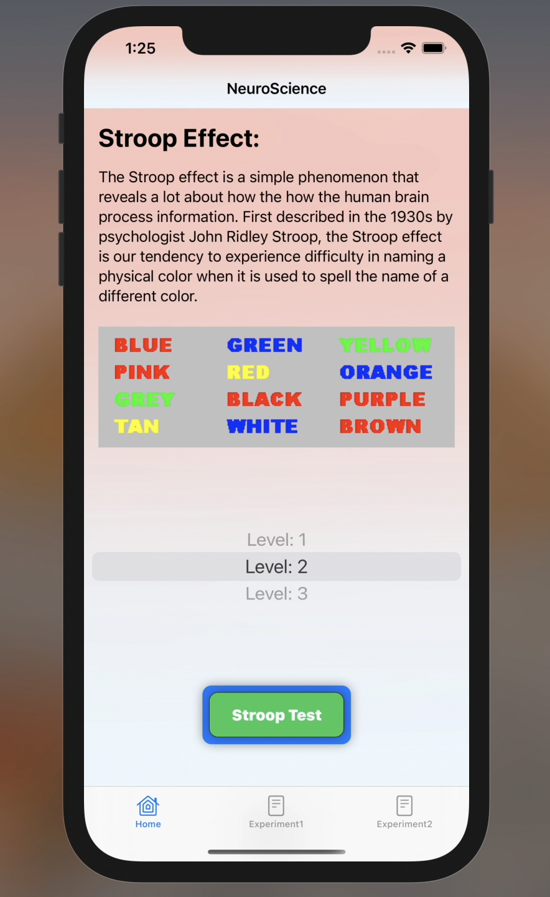

<h1>Stroop Effect   &nbsp; </h1>

---

This is a simple IOS App made with SwiftUI to demonstrate Stroop color word test.

#### Note
> This is a assignment made for my university so it is named HCI.

> The Experiment has two parts coherent and incoherent.

#### Preview

##### To clone this repository

> git clone https://github.com/reach-the-sky/Stroop-Test.git

If you liked my project and appreciate the content I opensource, consider following me on github [🌥](https://github.com/reach-the-sky).

